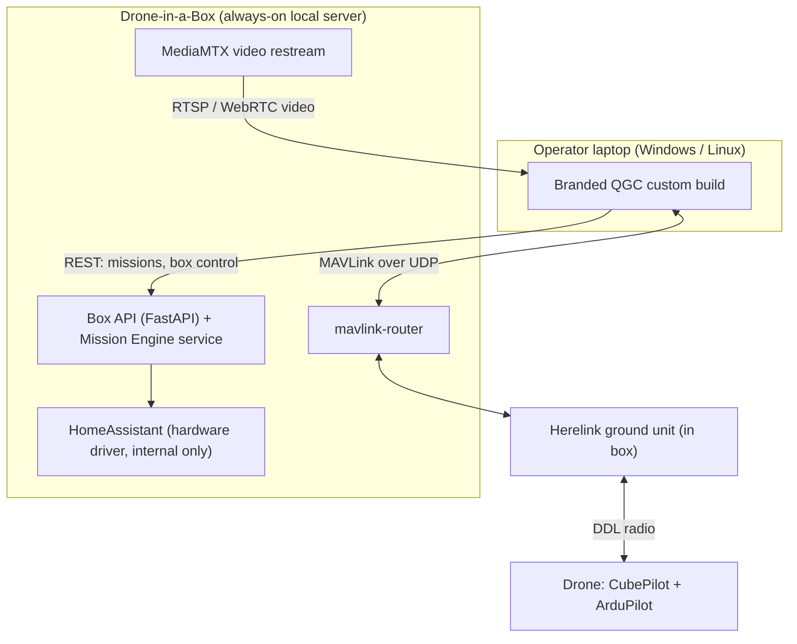
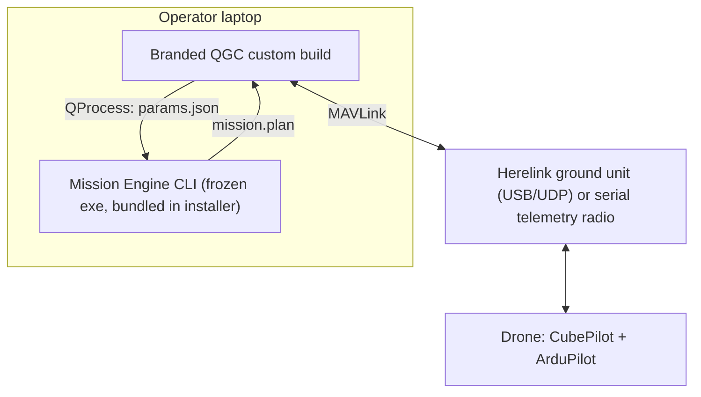

# GCS Design Document — PGC

**Status:** Draft v0.2 — for internal review and editing

**Date:** 2026-07-06

**Owners:** Samuel Kemp

**Decision summary:** Branded QGroundControl custom build as the GCS shell + proprietary Python Mission Engine + box services; a future self-hosted Fleet Console sits above the Box APIs. No from-scratch GCS. No Mission Planner fork.

---

## 1. Vision

A clean, professional, locally-run ground control product for our drone-in-a-box system and drone-only clients. Clients get one installer and one app ("opens and it works" — MP/QGC-grade simplicity with DJI/Skydio-grade cleanliness), with no cloud dependency, making security approval easy. We differentiate on parametric mission generation (solar-farm scanning, fencing, avoidance), box automation, and service — not on rebuilding commodity GCS plumbing.

**Product principles**

- Local-first: everything runs on the client's network. No account, no cloud, no telemetry phoning home.
- One install: a single signed installer per platform. The user never sees Python, servers, ports, or IPs.
- Subtract, don't rebuild: start from proven components; our code is the delta.
- Protect the escape hatch: our IP (Mission Engine, box services) stays GCS-agnostic so the shell can be replaced later without rewriting the core.

## 2. Users & Deployment Modes

**Personas**

- Client operator (primary): plans and monitors automated flights, controls the box. Non-expert. Sees only the branded app.
- Internal engineer (secondary): tuning, calibration, log analysis. May use stock QGC / Mission Planner alongside — full feature parity in our app is a non-goal.
- Manual pilot (fading): flies via Herelink RC + its onboard QGC. Manual flight in our desktop app is out of scope.
- Fleet operator (future): monitors many drones/sites from a browser (LAN or client-hosted VPN) and dispatches missions; never pilots. See §5.5.

**Deployment modes (both are first-class)**

- **Mode A — Box present:** the box is an always-on local server hosting MAVLink routing, video, box API, and the Mission Engine as a service. Desktop app connects over LAN.
- **Mode B — Drone only:** operator's laptop connects directly to the drone (Herelink ground unit over USB/UDP, or serial telemetry radio). The Mission Engine runs locally as a bundled, invisible CLI executable. No server anywhere.

## 3. Requirements

### 3.1 Functional

| ID | Requirement |
|----|-------------|
| F1 | Command & control of ArduPilot vehicles: arm, takeoff, mission start/pause/resume, RTL, land, mode changes |
| F2 | Live telemetry display: position on map, altitude, speed, battery, GPS health, link quality, failsafe status |
| F3 | Live video display from the drone (monitoring-grade latency; see N4) |
| F4 | Mission planning: draw polygon → generate serpentine survey (solar-farm scan) with camera/overlap parameters |
| F5 | Geofence generation and upload (inclusion fences) |
| F6 | Avoidance/keep-out zone definition (exclusion fences) honored by generated missions |
| F7 | Mission review before upload: visualize generated waypoints on map, edit if needed, upload to vehicle |
| F8 | Box control (Mode A): open/close, charge status, weather/environment readout, launch/recover sequences |
| F9 | Parametric mission generation is scriptable/extensible by our team in Python without touching GCS code |
| F10 | Missions exportable as standard `.plan` files (usable in stock QGC / MP as fallback) |
| F11 | Connection management: auto-detect box (Mode A) or connect via UDP/serial (Mode B) with a simple picker |

### 3.2 Non-functional

| ID | Requirement |
|----|-------------|
| N1 | Platforms: Windows 10/11 and mainstream Linux (Ubuntu LTS). Android (Herelink) remains stock/branded QGC — evaluate later |
| N2 | Single signed installer per platform; no separate runtimes, drivers*, or manual services (*except USB serial drivers where OS requires) |
| N3 | Fully functional offline / air-gapped after install (maps require pre-cached or self-hosted tiles) |
| N4 | Video glass-to-glass latency ≤ ~500 ms (monitoring). FPV-grade latency is explicitly not required (Herelink covers manual) |
| N5 | Telemetry UI updates ≥ 4 Hz on typical links |
| N6 | Mission Engine generates a mission for a typical solar-farm polygon in < 5 s on a modest laptop |
| N7 | Licensing compliance resolved before first client ship (see §7) |
| N8 | Upstream-friendly: QGC customization stays in the overlay so upstream merges remain routine |
| N9 | Box software is remotely updatable by us; desktop app updates are infrequent |

### 3.3 Non-goals (v1)

- Manual/FPV piloting in the desktop app (Herelink RC covers this)
- Cloud services, accounts, multi-tenant SaaS anything (the future fleet console is self-hosted — see §5.5)
- Multi-vehicle simultaneous control
- iOS/macOS support
- Full parameter/calibration UI (engineers use stock QGC/MP)
- Photogrammetry processing (we plan capture; processing is out of scope)
- Fleet Console build-out (v1 only lays the FC1–FC5 groundwork below; see §5.5 and Phase 6+)

### 3.4 Forward-compatibility requirements (fleet-ready)

Cheap to honor now, expensive to retrofit. These are the *only* fleet work permitted before v1 ships (see R10).

| ID | Requirement |
|----|-------------|
| FC1 | API-first box: every box capability exists as a versioned Box API endpoint; the UI is never the only path to an action |
| FC2 | Box API ships with token auth + TLS from day one |
| FC3 | Org-wide unique `SYSID_THISMAV` allocation scheme, defined once and applied to every vehicle |
| FC4 | Each box keeps structured local flight/mission logs (SQLite) so a future console can sync history |
| FC5 | No LAN-only assumptions: boxes may later join a client-hosted VPN overlay (WireGuard/Tailscale-class) |

## 4. System Architecture

### 4.1 Components

1. **Branded QGC (custom build)** — C++/Qt/QML. The only thing clients see. Stock QGC minus hidden complexity, plus our branding and two custom panels: *Mission Studio* and *Box Control*.
2. **Mission Engine** — pure Python library (Shapely, pymavlink). Our core IP. Two thin adapters: a stateless CLI (bundled inside the desktop installer) and a FastAPI service (deployed on the box).
3. **Box services** (Mode A only) — mavlink-router (link fan-out), MediaMTX (video restreaming), Box API (FastAPI: hardware control + Mission Engine service), HomeAssistant retained short-term as a hardware driver *behind* the Box API.
4. **Vehicle** — CubePilot flight controller + ArduPilot, linked via Herelink DDL. Unchanged.
5. **Fleet Console (future)** — self-hosted web app (Python/FastAPI + browser map UI) consuming Box APIs and video restreams across sites. Not built in v1; specified in §5.5.

### 4.2 Mode A — Box present



Notes: mavlink-router lets multiple consumers (our app, engineer's stock QGC, Box API) share the one vehicle link safely. The Box API is the *only* thing allowed to talk to HomeAssistant, so HA can be replaced later without touching the app.

### 4.3 Mode B — Drone only



Notes: the engine is invoked as a short-lived child process — no daemon, no ports, no background service to babysit. Identical engine codebase as Mode A.

### 4.4 Key data flows

**Mission creation (both modes)**

1. Operator draws polygon + sets parameters (altitude, GSD/overlap, panel row heading, keep-outs) in the Mission Studio panel.
2. Panel serializes parameters to JSON and invokes the engine (local CLI in Mode B; Box API in Mode A — Mode B path also works when a box is present, keeping v1 simple).
3. Engine returns a standard `.plan` (mission + fences).
4. QGC loads the plan into its native mission view for review/edit.
5. Operator uploads via QGC's stock, battle-tested upload path.

**Telemetry:** Drone → Herelink → (mavlink-router if box) → QGC native handling. We build nothing here.

**Video:** Drone cam → Herelink air unit (H.264) → RTSP → (MediaMTX on box for multi-consumer / browser-friendly restream) → QGC's native video widget. Mode B: QGC consumes the Herelink ground unit stream directly.

## 5. Component Specifications

### 5.1 Branded QGC custom build

- **Mechanism:** QGC's officially supported custom-build overlay (`custom/` directory pattern in the QGC source tree). Branding, feature flags, and our QML panels live in the overlay; upstream remains a clean merge target. Study the in-tree `custom-example` before estimating.
- **Pin the exact Qt version QGC specifies** (6.10.1 at time of writing — the project warns other versions inject instability).
- **Simplification pass:** hide advanced menus (parameter editor, calibration wizards, analyze tools) behind an "engineer mode" toggle or remove from client builds via build flags.
- **Custom panels:**
  - *Mission Studio* — polygon/keep-out drawing UX, parameter form, invokes engine, loads result. Thin: all logic lives in the engine.
  - *Box Control* — status + actions against the Box API (Mode A only; hidden when no box discovered).
- **Box discovery:** mDNS/zeroconf lookup with manual-IP fallback.
- **CI:** GitHub Actions matrix building Windows + Linux installers per tag; NSIS (Windows) and AppImage/deb (Linux) come with QGC's packaging.
- **Team warning:** first Qt/QGC build environment setup is a genuine slog for a Python-first team. Budget a frustrating week; script it once in CI so no one repeats it.

### 5.2 Mission Engine (our IP)

- **Form:** pure Python package; no GCS or Qt dependencies in the core.

```
mission_engine/
  core/
    geometry.py      # polygon ops, offsetting, clipping (Shapely)
    survey.py        # serpentine sweep gen: spacing from GSD/overlap, heading, entry/exit
    fence.py         # inclusion/exclusion fence generation
    plan_io.py       # read/write QGC .plan JSON; MAVLink mission item mapping
    params.py        # dataclasses + validation for mission parameters
  adapters/
    cli.py           # stateless: engine generate --input p.json --output m.plan
    api.py           # FastAPI wrapper for box deployment (thin; no logic)
  tests/             # unit tests + golden .plan files + SITL smoke tests
```

- **Inputs:** GeoJSON polygon(s), keep-out polygons, camera model, altitude or GSD, overlap %, sweep heading (manual or auto-from-longest-edge), speed.
- **Outputs:** QGC `.plan` (mission + geofence). Also loadable in stock QGC/MP → useful to our own team in week 2, before any panel integration exists.
- **Packaging:** PyInstaller (Nuitka as fallback) → single frozen executable per platform, code-signed, bundled inside the QGC installer. AV false positives on unsigned PyInstaller exes are a known issue — signing is the mitigation.
- **Testing:** unit tests on geometry; golden-file tests on `.plan` output; ArduPilot SITL smoke tests in CI (mission uploads and completes).
- **Simplicity rule (per team preference):** stateless functions, dataclasses in/out, no plugin framework until a third mission type exists.

### 5.3 Box services

- **mavlink-router:** one upstream (Herelink), N downstream endpoints (branded QGC, engineer's stock GCS, Box API listener). Config-file driven; systemd-managed.
- **MediaMTX:** single static binary; ingests Herelink RTSP, restreams RTSP/WebRTC for multiple consumers.
- **Box API (FastAPI):** REST for box hardware (via HA initially), mission generation endpoint (imports the same `mission_engine` package), health/status. Token auth + TLS from day one (FC2); mechanism/roles detail in OQ6.
- **HomeAssistant:** retained as hardware orchestration *behind* the Box API. Nothing outside the box may talk to HA directly. Revisit replacement only if it becomes a burden.
- **OS/update:** [TBD — current HA-OS vs plain Debian + systemd + our update channel] (OQ4).

### 5.4 Packaging & distribution

- One signed installer per platform containing: branded QGC + frozen Mission Engine CLI (+ bundled GStreamer per QGC's standard packaging).
- Box ships preconfigured from us; box updates via our channel (OQ4). Desktop app updates are rare by design (N9).
- Map tiles: default to self-hostable/OSM-compatible sources; **do not** ship Google/Bing tile access in the product without ToS review (see Risks R7).

### 5.5 Fleet Console (future component — post-v1)

- **What:** self-hosted web app for multi-site operations — Python/FastAPI backend + browser map UI. Positioning: "FlightHub without the cloud"; the client hosts it, preserving our local-first security story.
- **How it connects:** a sibling client of the same Box APIs and MediaMTX streams the QGC panels use, reached over a client-hosted VPN overlay (FC5). It owns no drone link of its own.
- **Scope ladder:** (1) *Monitor* — map of all sites/drones, box status, video thumbnails. (2) *Dispatch* — trigger parametric missions via each box's Mission Engine service; pause/resume/RTL/abort (discrete, latency-tolerant MAVLink commands). (3) *Remote manual piloting* — deliberately excluded (D10).
- **Division of labor:** branded QGC remains the on-site cockpit; QGC's native multi-vehicle support covers several drones per site. The console never replaces it.
- **Out of fleet scope:** drone-only clients (no box = nothing to aggregate). Acceptable product segmentation.
- **Trigger to build:** ≥2 boxes deployed + a client asking for central monitoring. Until then, FC1–FC5 are the entire investment.

## 6. Key Decisions (ADR summary)

| # | Decision | Alternatives rejected | Rationale | Status |
|---|----------|----------------------|-----------|--------|
| D1 | GCS = QGC custom build | From-scratch Electron+Python; PySide6 native; MP fork | 1–2 devs; complete proven GCS on day 1; work = subtraction + 2 panels, not rebuilding plumbing; official overlay keeps upstream merges | Accepted |
| D2 | Mission Engine = separate pure-Python package | Logic inside QGC (C++); logic inside a fork | Team speed; IP isolation; GCS-agnostic escape hatch; usable standalone week 2 | Accepted |
| D3 | Engine integration = stateless CLI child-process (Mode B) | Local background service/daemon | Zero glue to babysit: no ports, lifecycles, orphaned processes | Accepted |
| D4 | Box = local server (router, video, API, engine service) | Everything on laptop; cloud | Fits DiaB reality; local-first security story | Accepted |
| D5 | Keep HA short-term as hardware driver behind Box API | Immediate HA removal; building GCS on HA | Decouples now, defers migration cost | Accepted |
| D6 | Manual flight stays on Herelink | Joystick/FPV in our app | Removes hard-latency requirement; manual is being phased out | Accepted |
| D7 | License route: GPLv3 build vs Apache 2.0 + commercial Qt | — | See §7 | **Pending counsel** |
| D8 | Maps: self-hosted/OSM-style tiles by default | Google/Bing default | Offline requirement + provider ToS risk | Proposed |
| D9 | Fleet tier = separate self-hosted web console above Box APIs | Extending QGC into an ops center; cloud SaaS | QGC is single-operator by design; deep divergence breaks N8; self-hosting preserves local-first | Accepted (build post-v1) |
| D10 | Fleet control depth = monitor + dispatch; no remote manual piloting | Joystick-over-internet | C2 latency/reliability/liability; manual flight is being phased out anyway | Accepted (revisit only if manual returns) |

## 7. Licensing (decision pending — route options)

*Not legal advice. One hour with counsel before first client ship (N7).*

- **QGC is dual-licensed Apache 2.0 / GPLv3** — we choose which to comply with.
- **Route A — GPLv3 build (free Qt):** our overlay code compiled into the app becomes GPLv3; we must offer corresponding source *to clients who receive binaries* (not the public). GPL stops at the process boundary → Mission Engine, Box API, video pipeline stay proprietary. Trademark/brand unaffected. Exposure ≈ QML skin + panels, which is not our moat.
- **Route B — Apache 2.0 build (proprietary overlay):** QGC's docs state a commercial Qt license is required for Apache builds (order of a few $k per developer per year — verify current pricing/tiers). Keeps overlay code closed.
- **Supporting cast:** MAVLink (MIT), MediaMTX (MIT), Shapely (BSD) — fine. pymavlink & mavlink-router (LGPL) — fine as used. ArduPilot (GPLv3) — separate program on the vehicle, no effect on us. **GStreamer plugin set** we redistribute needs a license/codec review. Upstream contributions must be offered under both QGC licenses.
- **Working recommendation:** Route A unless counsel or leadership objects; revisit if we ever put moat-level logic inside the app (we shouldn't — see D2).

## 8. Risks & Mitigations

| # | Risk | Mitigation |
|---|------|------------|
| R1 | Qt/C++/QML learning curve stalls a Python team | Budget a setup week; CI-scripted builds; keep overlay thin; all logic in Python engine |
| R2 | QML skinning ceiling — can't reach desired "clean" | Timebox a skinning spike in Phase 2; client feedback decides; escape hatch = engine/box carry over to a future custom UI |
| R3 | PyInstaller AV false positives look unprofessional | Code-sign engine exe + installer; Nuitka fallback |
| R4 | Upstream QGC drift breaks overlay | Pin releases; merge upstream on a schedule (not ad hoc); keep customization additive |
| R5 | Licensing misstep | §7 counsel review before ship; D7 gate on Phase 5 |
| R6 | mDNS discovery flaky on client networks | Always offer manual IP/host entry; QR label on box |
| R7 | Map tile ToS / offline needs | Self-hosted or OSM-compatible tiles; pre-cache workflow for sites |
| R8 | GStreamer codec/plugin licensing in redistribution | Inventory shipped plugins during Phase 5 packaging review |
| R9 | Herelink constraints (stream formats, USB modes) surprise us | Early Phase 0 spike: exercise Herelink→laptop link + RTSP on both OSes |
| R10 | Fleet ambitions distract v1 (premature generalization) | FC1–FC5 are the only fleet work allowed before Phase 5 exit; console build gated per D9 trigger |

## 9. Roadmap (1–2 dedicated devs)

**Phase 0 — Spikes & environment (wk 1–2)**
Build stock QGC from source on Win+Linux (CI too); ArduPilot SITL running; Herelink→laptop MAVLink + RTSP verified on both OSes.
*Accept:* stock QGC built by CI connects to SITL and to the real drone via Herelink.

**Phase 1 — Mission Engine MVP (wk 2–6, parallel with P0/P2)**
`core` + CLI; serpentine survey from polygon; inclusion fence; keep-outs clipped; golden tests + SITL smoke test.
*Accept:* polygon JSON in → `.plan` out; loads in stock QGC and MP; SITL flies it; a solar-scan our team actually uses replaces the current MP scripting workflow.

**Phase 2 — Branded QGC (wk 3–8)**
Overlay build: name/logo/colors; hide engineer features; installers produced in CI.
*Accept:* a client-presentable installer; upstream merge performed once without drama.

**Phase 3 — Mission Studio integration (wk 8–12)**
QML panel: draw → params → QProcess engine → load plan for review/upload.
*Accept:* operator plans and flies a solar scan end-to-end (SITL + field test) without leaving the app.

**Phase 4 — Box integration (wk 12–16)**
mavlink-router, MediaMTX, Box API (+ engine service), HA behind API; Box Control panel; discovery.
*Accept:* Mode A end-to-end: app auto-finds box, video shows, box actions work, mission runs.

**Phase 5 — Productization (wk 16–20)**
Code signing, license decision executed (D7), GStreamer/tiles review (R7/R8), docs, pilot-client install.
*Accept:* one pilot client running unassisted.

**Phase 6+ — Fleet Console (future horizon, gated)**
Self-hosted web console: monitor first (sites map, statuses, video), dispatch second (engine-generated missions, pause/RTL/abort via Box APIs). Gate: ≥2 boxes deployed + client demand (D9).
*Accept:* an office user monitors two live sites and remotely dispatches a solar scan that a box executes end-to-end.

*Weeks are effort-order estimates for planning, not commitments.*

## 10. Open Questions

- [ ] OQ1: Product name / branding assets?
- [ ] OQ2: Drone-only clients' physical links — Herelink ground unit only, or also serial radios (RFD900 etc.)? (drives F11 scope + Phase 0 spike)
- [ ] OQ3: License route (D7) — Route A or B? Counsel booked?
- [ ] OQ4: Box OS/update strategy — keep HA-OS short-term or move to Debian+systemd now?
- [ ] OQ5: Tile source & offline caching workflow for client sites?
- [ ] OQ6: Box API auth mechanism (token vs per-client certs) and future console user model (roles? read-only viewers?) — auth itself is now required day one (FC2)
- [ ] OQ7: Do we ever want our app on the Herelink screen itself, or does stock/branded QGC there suffice long-term?
- [ ] OQ8: Which camera(s)/gimbal must the survey math support first? (sensor size, focal length for GSD calc)
- [ ] OQ9: VPN overlay choice and who administers it — us or client IT? (WireGuard, Tailscale/Headscale-class, other)
- [ ] OQ10: Where does the Fleet Console run — a designated box, a client server, or a small appliance we ship?

## 11. References

- QGC dev guide (build, custom builds, licensing): https://docs.qgroundcontrol.com/master/en/qgc-dev-guide/
- QGC source (see `custom-example/`): https://github.com/mavlink/qgroundcontrol
- QGC `.plan` file format: https://docs.qgroundcontrol.com/master/en/qgc-dev-guide/file_formats/plan.html
- mavlink-router: https://github.com/mavlink-router/mavlink-router
- MediaMTX: https://github.com/bluenviron/mediamtx
- pymavlink: https://github.com/ArduPilot/pymavlink
- ArduPilot SITL: https://ardupilot.org/dev/docs/sitl-simulator-software-in-the-loop.html
- Shapely: https://shapely.readthedocs.io/
